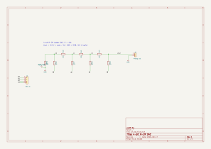

# R-2R DAC 
A technical design of a 4 bit "resistor ladder" than takes 16 bits of information to divide a voltage of 3.3V to a resolution of 1/16

Each bit can be switched on or off, either 3.3V or 0V (ground). The on/off state of each bit can be represented, from `1000`, `0100`, `0010`, `0001`.

Due to the voltage divider formula

$$V_{out} = V_{in} \cdot \frac{R_2}{R_1 + R_2}$$

each bit gives half of the one above it because the equivalent resistance between each node and the ground is 2R / it remains the same for each node.

The voltage at the node $V_{out}$ is changed and halved for each corresponding change in bits from `1000` to `0100`, etc, $\frac{1}{2}$ to $\frac{1}{4}$ etc all the way to $\frac{1}{16}$. Thus, the finest possible resolution in this case is $\frac{1}{16}$, when only one bit is turned on, ie `0001`.

If more than one bit is turned on, ie. `0110` voltage of the two bits $\frac{1}{4}$ and $\frac{1}{8}$ of $V_{in}$ respectively would add to create $\frac{3}{8}$ of the $V_{in}$ into $V_{out}$.

This addition is due to superposition, since this circuit is made only of resistors and sources, you can turn on one bit at a time (with the others set to zero): in turn working out the effect of each source, and then add the results.

The final equation $V_{out}$ can be written as

$$V_{out} = V_{in} \cdot \frac{\text{decimal conversion of the binary code}}{16}$$

## Concept board

`pcb/` holds a concept two-layer layout for this circuit: 33 × 20 mm, 0805 resistors, 2.54 mm headers for the four
bits (B0 to B3) and for VOUT and GND, with a ground pour on the bottom layer. `pcb/make_pcb.py` writes the Gerbers and
drill file in `pcb/gerbers/` from the same netlist as `r2r_dac.cir`.

The board has not been manufactured and has not been through a design-rule check in an EDA tool. A 3D view of it is on
[justin.brogu.ca/p/r2r-dac](https://justin.brogu.ca/p/r2r-dac/).
